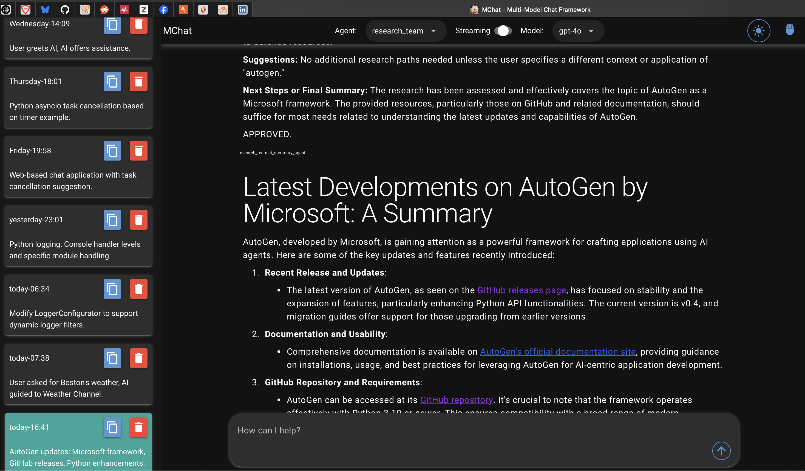

# mchat

[](LICENSE)

## Description
*mchat* is an entirely text-based LLM chat application with support for different LLMs and pre-establshed customizable prompt 'personas' that support mult-shot prompts.  *mchat* uses the excellent [Textual](https://textual.textualize.io) framework for a GUI-like experience complete with mouse support and should run anywhere a decent terminal is available, including over SSH. 

All that is needed is an OpenAI API key.  Azure OpenAI will also work, but you will need to disable the Dall-E support if you don't also have an OpenAI API key.


*New* - Dall-E support added using the `dall-e` keyword, and an 'image composer' persona to help create prompts.




## TODO
- [x] Copy text to past buffer when clicking on the response
- [x] Agent support
- [x] Support Multi-line prompts
- [x] History and reloadable sessions with local database storage
- [x] Support for image creation (currently just dall-e)
- [x] Support for functions/tools
- [x] Round Robin multi-agent support
- [ ] Swarm multi-agent support
- [x] Selector multi-agent support
- [x] Cancellation Buttons to stop running team
  

## Table of Contents
- [mchat](#mchat)
  - [Description](#description)
  - [TODO](#todo)
  - [Table of Contents](#table-of-contents)
  - [Installation](#installation)
  - [Configuration](#configuration)
    - [Models](#models)
    - [Model Lists](#model-lists)
    - [Model Configuration](#model-configuration)
    - [Default Settings](#default-settings)
    - [Memory Model Configuration](#memory-model-configuration)
    - [Secrets Configuration](#secrets-configuration)
  - [Agents](#agents)
  - [Usage](#usage)
      - [Alternative Usage](#alternative-usage)
  - [Contributing](#contributing)
  - [License](#license)
  - [Contact](#contact)

## Installation
1. Make sure you have Python and uv installed on your system. If not, you can download and install them from their official websites:
   - Python: https://www.python.org
   - UV: https://github.com/astral-sh/uv

2. Until supported by autogen, mchat depends on a slightly modified version of autogen located below.  Clone or download this version and checkout the *stream_token_0.4* branch
   - Autogen: https://github.com/jspv/autogen/tree/stream_token_0.4

3. Clone this repository to your local machine or download and extract the source code.  mchat will expect to find autogen located as a peer directory.  E.g. /src/mchat and /src/autogen; autogen should be at ../autogen in relation to mchat.  

4. Open a terminal or command prompt and navigate to the project directory.

5. Run the following command to install the project dependencies:

   ```shell
   uv sync --all-extras
   ```

   This will create a virtual environment and install all the required dependencies specified in the `pyproject.toml` file.

## Configuration

Configuration is done within three files: `settings.toml`, `.secrets.toml`(optional, but recommended) and `agents.yaml`

Open the settings.toml file in a text editor to configure your application. Here's an explanation of the provided configuration options:

### Models

- model_families: A list of model families available, the default shows "oai_models" (OpenAI Models) and "ms_models" (Microsoft Models).  A Model family is a group of models that use the same API access token.
  
### Model Lists

For each model family, list names of the models supported in that family, precede each model with the same prefix used in for the model family.  The names you use do not have to match the actual ones used by the underlying API.  

- oai_models: A list of OpenAI models, including "oai_gpt-3.5-turbo" and "oai_gpt-4".
- ms_models: A list of Microsoft models, including "ms_openai_gpt_35".

### Model Configuration

For each model, you can configure the following properties:

- <model_name>.deployment: Specifies the deployment of the model, for OpenAI models, this is the actual OpenAI model name, for Microsoft models, this is the deployment name.
- <model_name>.max_tokens: Specifies the maximum number of tokens for the model.

### Default Settings

- default_model: Specifies the default model to use.
- default_temperature: Specifies the default temperature for generating text.
- default_persona: Specifies the default persona for generating text.
  
### Memory Model Configuration
mchat maintains memory of the current chat in order to retain context in long conversations.  When the retained memory exceeds the size the model supports, it will summarize the convseration to reduce size.  Since this can be called often for longer chats, it is recommended to use an inexpensive model.  

You can configure the following properties:

- memory_model: Specifies the specific model to use for memory, use one of the models you sepcified in your model lists
- memory_model_temperature: Specifies the temperature for the memory model.
- memory_model_max_tokens: Specifies the maximum tokens for the memory model.
  
### Secrets Configuration
Note that some configuration options, such as API keys, are meant to be kept in a separate .secrets.toml file. You can include the following configuration in that file:

``` shell
# In .secrets.toml
# dynaconf_merge = true

# Replace the following with your actual API keys
# openai_models_api_key = "oai_ai_api_key_goes_here"
# ms_models_api_key = "ms_openai_api_key_goes_here"
```

## Agents

mchat comes with a default persona and two example agents *linux computer* and *financial manager*.  Additional agents can be added in a ```agents.yaml``` file at the top level (same level as this README) using a similar pattern to `mchat/default_personas.yaml` in the code.  When configuring personas, the ```extra_context``` list can allow you to respresent a multi-shot prompt, see the `linux computer` persona in `mchat/default_personas.json` as an example.

## Usage
1. Run the application in uv using the following command
   
   ```shell
   uv run poe mchat
   ``````

#### Alternative Usage
1. Activate the virtual environment created by uv using the following command:

   ```shell
   source ./.venv/bin/activate
   ```

3. Run the application using the following command:

   ```shell
   poe mchat
   ```

## Contributing

Thank you for considering contributing to the project! To contribute, please follow these guidelines:

1. Fork the repository and clone it to your local machine.

2. Create a new branch for your feature or bug fix:

   ```shell
   git checkout -b feature/your-feature-name
   ```

   Replace `your-feature-name` with a descriptive name for your contribution.

3. Make the necessary changes and ensure that your code follows the project's coding conventions and style guidelines - which currently are using PEP 8 for style and *black* for formatting 

4. Commit your changes with a clear and descriptive commit message:

   ```shell
   git commit -m "Add your commit message here"
   ```

5. Push your branch to your forked repository:

   ```shell
   git push origin feature/your-feature-name
   ```

6. Open a pull request from your forked repository to the main repository's `main` branch.

7. Provide a clear and detailed description of your changes in the pull request. Include any relevant information that would help reviewers understand your contribution.


## License
This project is licensed under the [MIT License](LICENSE).

## Contact
Feel free to reach out to me at @jspv on GitHub
