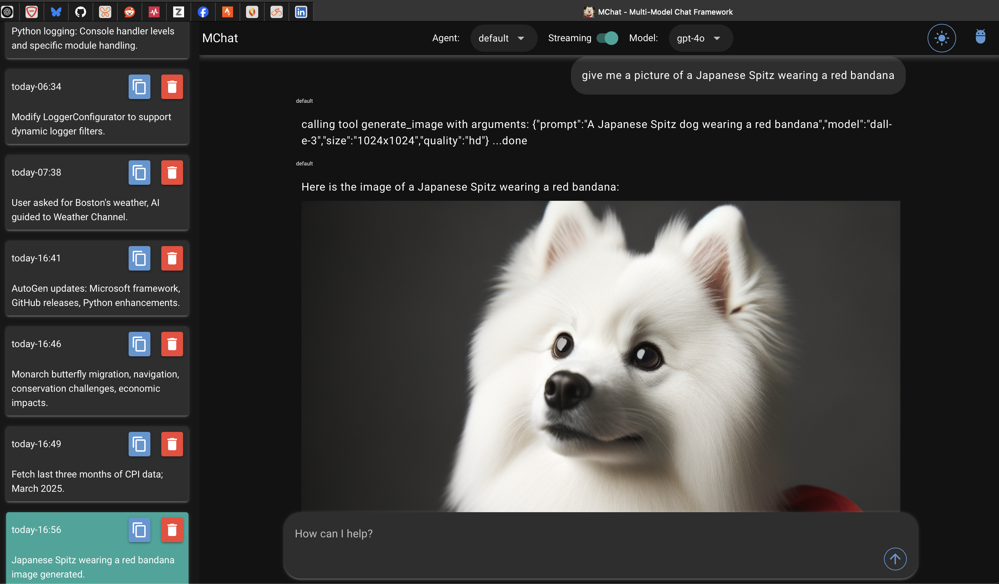

# mchat

[](LICENSE)

## Description (OLD)
*mchat* **was** an entirely text-based LLM chat application with support for different LLMs and pre-establshed customizable prompt 'personas' that support mult-shot prompts.  *mchat* uses the excellent [Textual](https://textual.textualize.io) framework for a GUI-like experience complete with mouse support and should run anywhere a decent terminal is available, including over SSH. 

## Description (NEW)
NEW: As good as Textual is, I needed to move to a more graphically capable UI
to be able to support embedded images, LaTeX, and graphing.  To support this
I have migrated the frontend to [Nicegui](https://nicegui.io)  The Textual code is still present and should continue to work, but I will not likely be 
maintaining it.  

All that is needed is an OpenAI API key.  Azure OpenAI will also work, but you will need to disable the Dall-E support if you don't also have an OpenAI API key.

## Screenshots 




Easy to modify agents and teams:


## TODO
- [x] Copy text to past buffer when clicking on the response
- [x] Agent support
- [x] Support Multi-line prompts
- [x] History and reloadable sessions with local database storage
- [x] Support for image creation (currently just dall-e)
- [x] Support for functions/tools
- [x] Round Robin multi-agent support
- [ ] Swarm multi-agent support
- [x] Selector multi-agent support
- [x] Cancellation Buttons to stop running team
- [ ] Smarter handling of user_proxy_agent
- [ ] Nice display for 'thought' messages for reasoning models
- [ ] AWS Bedrock support
  

## Table of Contents
- [mchat](#mchat)
  - [Description (OLD)](#description-old)
  - [Description (NEW)](#description-new)
  - [Screenshots](#screenshots)
  - [TODO](#todo)
  - [Table of Contents](#table-of-contents)
  - [Installation](#installation)
  - [Configuration](#configuration)
    - [Models](#models)
    - [Important](#important)
    - [Required Fields](#required-fields)
    - [Default Settings](#default-settings)
    - [Memory Model Configuration (NOTE: Currently disabled)](#memory-model-configuration-note-currently-disabled)
    - [Secrets Configuration](#secrets-configuration)
  - [Agents \& Teams](#agents--teams)
  - [Usage](#usage)
      - [Alternative Usage](#alternative-usage)
  - [Contributing](#contributing)
  - [License](#license)
  - [Contact](#contact)

## Installation
1. Make sure you have Python and uv installed on your system. If not, you can download and install them from their official websites:
   - Python: https://www.python.org
   - UV: https://github.com/astral-sh/uv


2. Open a terminal or command prompt and navigate to the project directory.

3. Run the following command to install the project dependencies:

   ```shell
   uv sync --all-extras
   ```

   This will create a virtual environment and install all the required dependencies specified in the `pyproject.toml` file.

## Configuration

Configuration is done within three files: `settings.toml`, `.secrets.toml`(optional, but recommended) and `agents.yaml`

Open the settings.toml file in a text editor to configure your application. Here's an explanation of the provided configuration options:

### Models

Sections need to start with model. (with period) and no other periods in the section name `models.type.model_id` model_id is what will show in the interface.

```
[models.chat.gpt-4o]
api_key = "@format {this.openai_api_key}"
model = "gpt-4o"
api_type = "open_ai"
base_url = "https://api.openai.com/v1"
```

### Important
Image models and settings here are for expliclitly calling the immage models from the prompt. The generate_image tool does not use these settings, only the API key

### Required Fields
Chat Models
- api_type: ["open_ai", "azure"]
- model_type: "chat"
- model: "name of model"
- api_key: "your key or dynaconf lookup to get the key"
- model: "the openai name for the model"

Azure Chat Models (additional)
- azure_endpoint: "URL for your endpoint"
- azure_deployment: "the azure name for the model in your deployment"
- api_version = "api version"

Image Models
- api_type: ["open_ai", "azure"]
- model_type: "image"
- model: "name of model"
- size: "size of images to create"
- num_images: "number of images to create"
- api_key: "your key or dynaconf lookup to get the key"

### Default Settings

- default_model: Specifies the default model to use.
- default_temperature: Specifies the default temperature for generating text.
- default_persona: Specifies the default persona for generating text.
  
### Memory Model Configuration (NOTE: Currently disabled)
mchat maintains memory of the current chat in order to retain context in long conversations.  When the retained memory exceeds the size the model supports, it will summarize the convseration to reduce size.  Since this can be called often for longer chats, it is recommended to use an inexpensive model.  

You can configure the following properties:

- memory_model: Specifies the specific model to use for memory, use one of the models you sepcified in your model lists
- memory_model_temperature: Specifies the temperature for the memory model.
- memory_model_max_tokens: Specifies the maximum tokens for the memory model.
  
### Secrets Configuration
Note that some configuration options, such as API keys, are meant to be kept in a separate .secrets.toml file. You can include the following configuration in that file:

``` shell
# In .secrets.toml
# dynaconf_merge = true

# Replace the following with your actual API keys
# openai_models_api_key = "oai_ai_api_key_goes_here"
# ms_models_api_key = "ms_openai_api_key_goes_here"
```

## Agents & Teams

mchat comes with a default persona and two example agents *linux computer* and *financial manager* and example round-robin and selector teams.  Additional agents and teams can be added in a ```agents.yaml``` file at the top level (same level as this README) using a similar pattern to `mchat/default_personas.yaml` in the code.  When configuring personas, the ```extra_context``` list can allow you to respresent a multi-shot prompt, see the `linux computer` persona in `mchat/default_personas.json` as an example.

## Usage
1. Run the application in uv using the following command
   
   ```shell
   uv run poe mchat
   ``````

#### Alternative Usage
1. Activate the virtual environment created by uv using the following command:

   ```shell
   source ./.venv/bin/activate
   ```

3. Run the application using the following command:

   ```shell
   poe mchat
   ```
   or
   ```shell
   python -m mchat.main
   ```

## Contributing

Thank you for considering contributing to the project! To contribute, please follow these guidelines:

1. Fork the repository and clone it to your local machine.

2. Create a new branch for your feature or bug fix:

   ```shell
   git checkout -b feature/your-feature-name
   ```

   Replace `your-feature-name` with a descriptive name for your contribution.

3. Make the necessary changes and ensure that your code follows the project's coding conventions and style guidelines - which currently are using PEP 8 for style and *black* for formatting 

4. Commit your changes with a clear and descriptive commit message:

   ```shell
   git commit -m "Add your commit message here"
   ```

5. Push your branch to your forked repository:

   ```shell
   git push origin feature/your-feature-name
   ```

6. Open a pull request from your forked repository to the main repository's `main` branch.

7. Provide a clear and detailed description of your changes in the pull request. Include any relevant information that would help reviewers understand your contribution.


## License
This project is licensed under the [MIT License](LICENSE).

## Contact
Feel free to reach out to me at @jspv on GitHub
